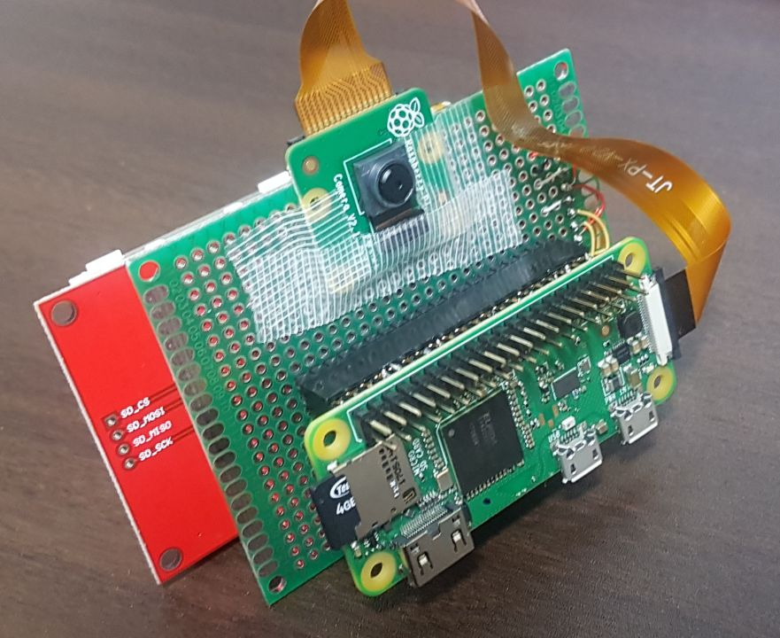
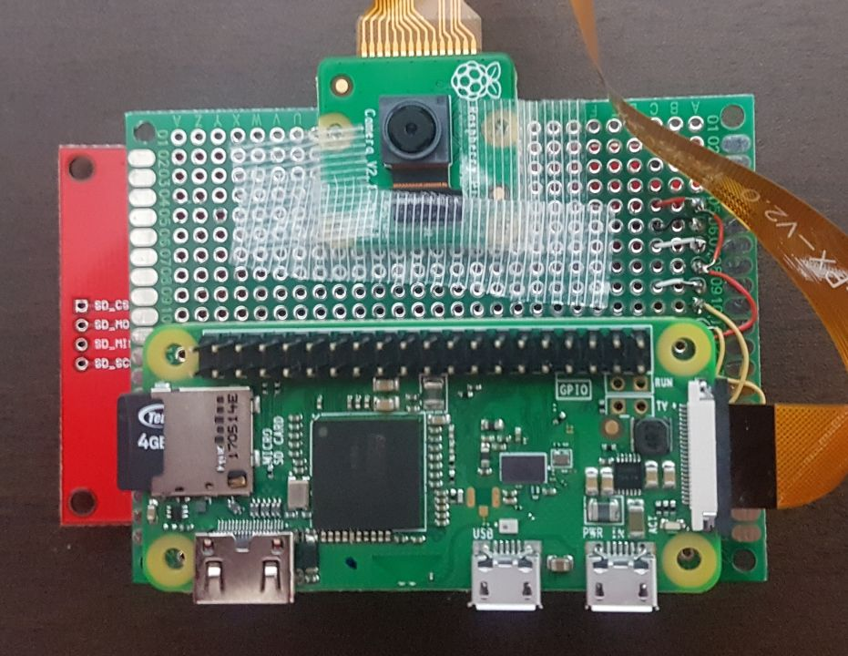
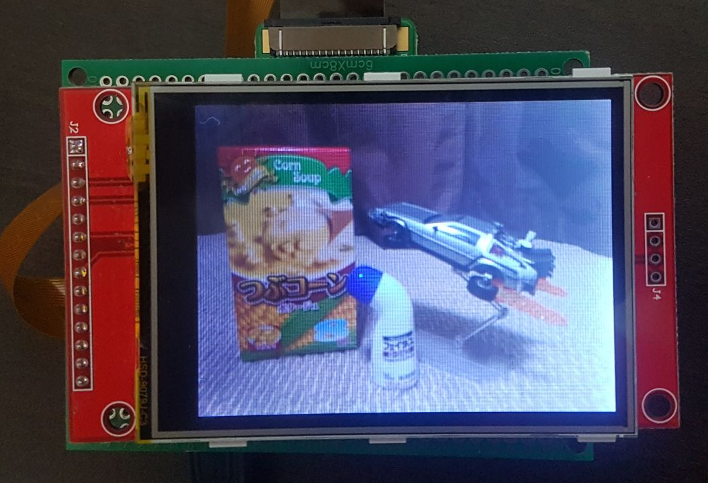
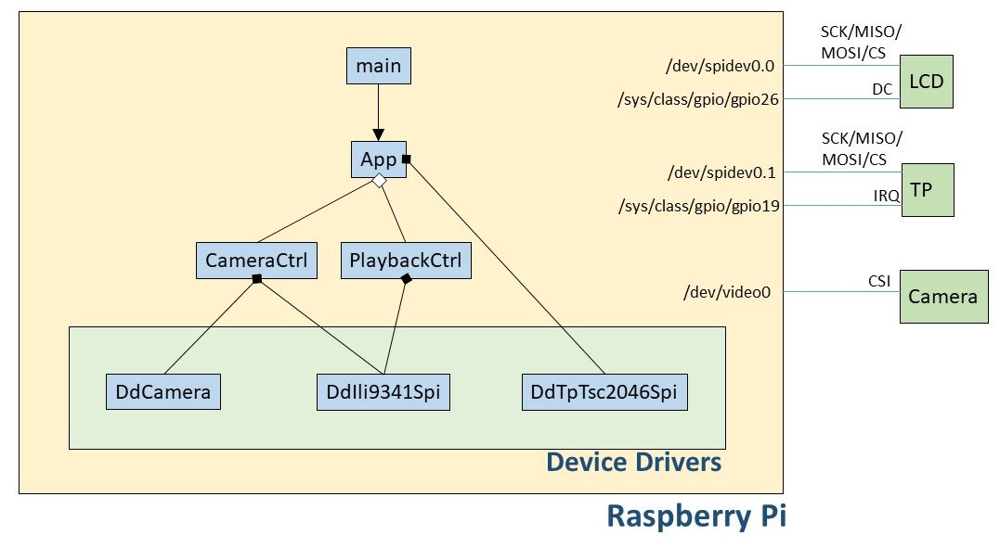

# Digital Camera with Raspberry Pi in Linux Standard Way
This is a Raspberry Pi Project to create a digital camere in Linux standard way.  
Device files and related system calls (open/write/ioctl/select) are used to access devices instead of using external libraries. To access a camera from C++ userland, I used  Video 4 Linux Two (V4L2) API.

<table><tr>
<td></td>
<td></td>
</tr></table>

## Specs
- Liveview (around 20fps)
- Still capture (320 x 240 JPEG file)
- Playback (JPEG file)

## Devices
- Raspberry Pi Zero W
	- can be work on Pi2/3
	- OS: 2017-09-07-raspbian-stretch-lite
- 2.8 inch LCD Module
	- 320 x 240
	- ILI9341 SPI interface
- Touch Panel (TP)
	- TSC2046 SPI interface (ADS8746 compatible)
- Camera
	- Raspberry Pi Camera V2

## Overview

Note: LCD(spidev0.0) and TP(spidev0.1) share SCK/MISO/MOSI.

### Software Modules
- App
	- Application main class
	- treats user input from TP module, and manages mode (liveview/playback)
	- creates/deletes an appropreate control class (CameraCtrl and PlaybackCtrl are ready so far)
- CameraCtrl
	- A class to control liveview and capture
- PlaybackCtrl
	- A class to control playback
	- uses libjpeg
- DdCamera
	- A class to access camera module using video device file (v4l2)
- DdIli9341Spi
	- A class to access LCD using SPI and GPIO device files
- DdTpTsc2046Spi
	- A class to access Touch Panel using SPI and GPIO device files

### Hardware Connection
- LCD (SPI0.1 (/dev/spidev0.0))
	- LCD_SCLK: SPI0_SCLK
	- LCD_MOSI: SPI0_MOSI
	- LCD_MISO: SPI0_MISO
	- LCD_CS: SPI0_CE0_N 
	- DC: GPIO 26 (/sys/class/gpio/gpio26)
- TP (SPI0.1 (/dev/spidev0.1))
	- TP_SCLK: SPI0_SCLK
	- TP_MOSI: SPI0_MOSI
	- TP_MISO: SPI0_MISO
	- TP_CS: SPI0_CE1_N
	- IRQ = GPIO 19 (/sys/class/gpio/gpio19)
- Camera (/dev/video0)
	- CSI port 

## How to run
- Enable Camera and SPI from `sudo raspi-config`
- If you want to just run the application
	- `sudo apt-get install libjpeg-dev`
	- `make`
	- `sudo modprobe bcm2835-v4l2`
	- `./a.out`
- If you want the application to start automatically
	- run `sh ./install.sh` to install, which does:
		- build the project
		- install libjpeg
		- setup cron for auto start
	- reboot by `sudo reboot yes`

### how to control
- Photo Capture: Tap around the center during liveview mode
- Mode change: Tap any corner or edge
- Playback next picture: Tap around the center during playback mode

